# 코발트 커피

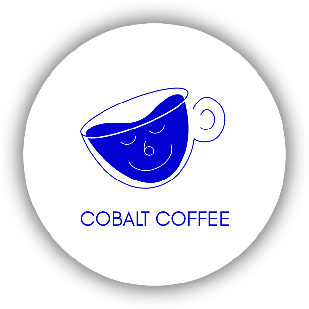

 

## 프로젝트 소개
**코발트 커피** 프로젝트는 Android Mobile Application 프로젝트로, 가상의 카페앱 제작의뢰를 상정하여 어떤 기능이 필요할지 요구사항을 추려내고, 해당 요구사항에 따라 기능을 구현한 **개발진의 역량향상** 프로젝트입니다.

코발트 블루 색상에서 테마색을 착안하였고, 주로 **스타벅스** 및 **이디야 커피** 애플리케이션의 UI 구성 및 기능을 클론코딩하고자 하였습니다.

- 2022.11.25. 삼성청년소프트웨어아카데미(SSAFY) 8기 Mobile 트랙 1학기 관통프로젝트 최우수

 

## 목차
- [참여자](#참여자)
- [발표자료](#발표자료)
- [기간](#기간)
- [기능구현](#기능구현)
- [스크린샷](#스크린샷)

 

## 참여자

| 조수연([@su6378](https://github.com/su6378)) | 한재용([@rigizer](https://github.com/rigizer)) |
|:----:|:----:|
|||

 

# 발표자료
[다운로드](ppt/221125_8기_구미_6반_관통PJT_한재용_조수연.pptx) (*.pptx)

 

## 기간
2022.11.17. ~ 2022.11.25.

 

# 사용 기술스택
- Android
  - Android Studio
  - Kotlin
  - AndroidX ROOM
  - SQLite
  - 부트페이 API
- Back-end
  - AWS Lightsail
  - Java
  - Spring Boot
  - MariaDB

## 기능구현
- 스플래시
    - Lottie 이용한 로딩화면 구현
- 안드로이드 커스텀 폰트 적용
- FitButton 이용한 커스텀 버튼 구현
- Retrofit 이용하여 AWS Lightsail의 MariaDB와 RestAPI 통신
- CollapsingToolbarLayout 사용하여 레이아웃 애니메이션 적용
- SliderShow 라이브러리 사용하여 배너광고 애니메이션 적용
- SharedPreference, Room 등 라이브러리 활용
- SwitchButton 라이브러리 활용하여 토글버튼 구현

 

## 스크린샷
<h5>스플래시</h5>

- Handler 이용하여 overridePendingTransition 애니메이션 적용

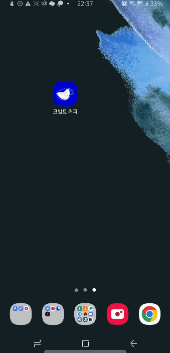
 

<h5>로그인</h5>

- 정규표현식 패턴 사용
- 자동로그인 구현 (SharedPreference 사용)

| 자동로그인 ON | 자동로그인 OFF | 계정정보 불일치 |
|:----:|:----:|:----:|
|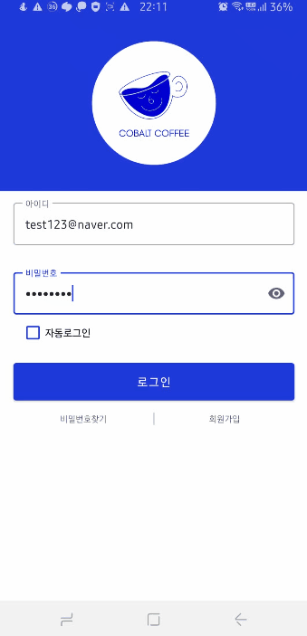|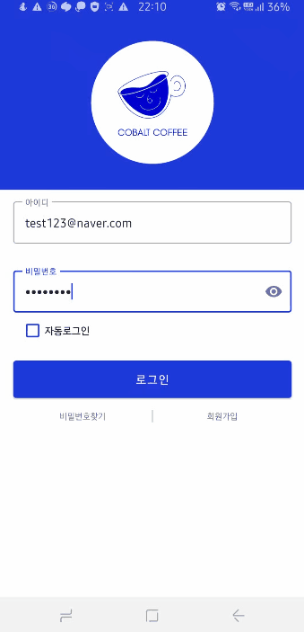|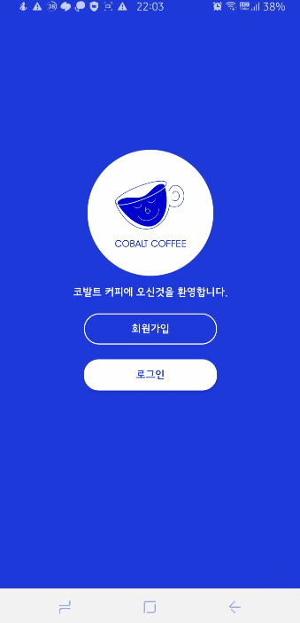|
 

<h5>회원가입</h5>

- 정규표현식 패턴 사용

| 이메일 중복확인 | 비밀번호 확인 |
|:----:|:----:|
|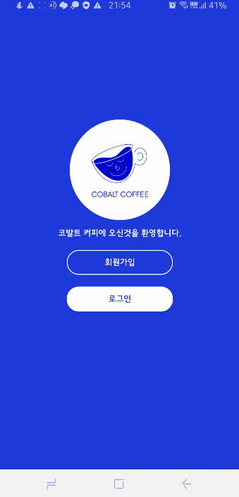||
 

<h5>홈</h5>

- Lottie 라이브러리 사용
- CollapsingToolbarLayout 사용
- SliderShow 라이브러리 사용

| CollapsingToolbarLayout | 첫 번째 배너 |
|:----:|:----:|
||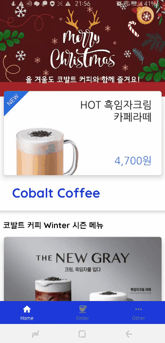|

| 수평 슬라이더 메뉴 | 하단 배너 | 뒤로가기 버튼 |
|:----:|:----:|:----:|
|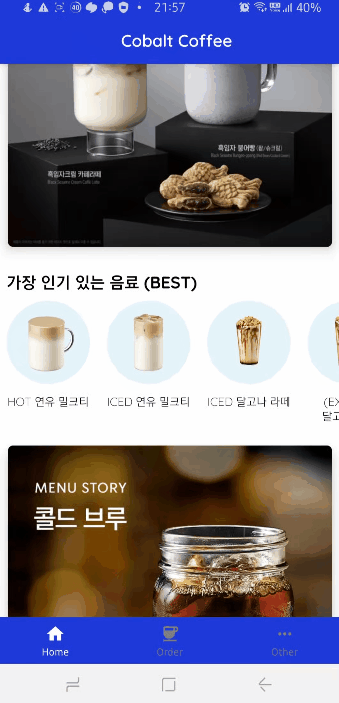|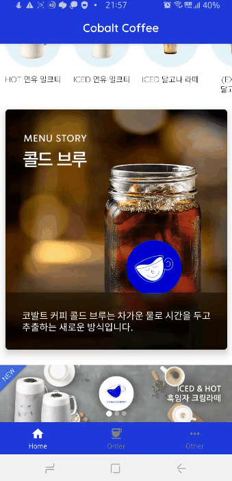||
 

<h5>주문</h5>

- 배너광고 무한스크롤, 자동스크롤 지원
- FitButton 라이브러리 사용

| 주문 전 | 최근 주문 내역 |
|:----:|:----:|
||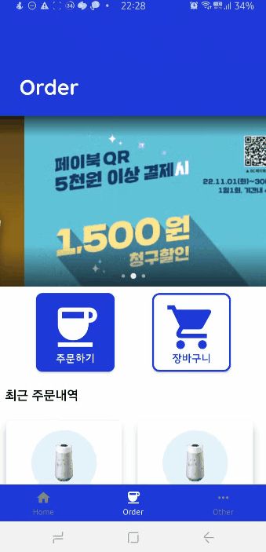|
 

<h5>메뉴</h5>

- RecyclerView, Retrofit 이용하여 메뉴정보 조회

| 싱품목록 | 상품 상세정보 |
|:----:|:----:|
|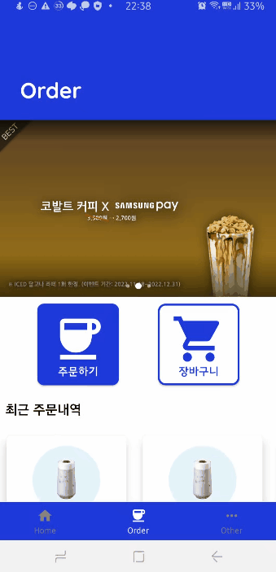|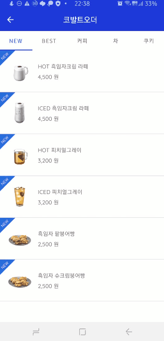|
 

<h5>장바구니</h5>

- Android Room 이용하여 SQLite 접근
- Retrofit 이용하여 상품정보 조회

| 주문 | 주문불가 |
|:----:|:----:|
|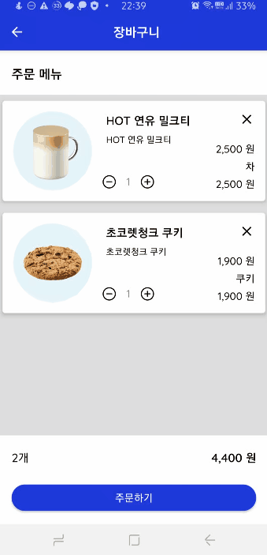|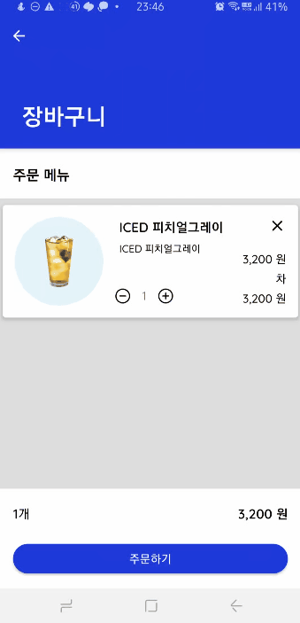|
 

<h5>결제</h5>

- 부트페이 API 사용하여 결제기능 구현
- 신용/체크카드, 카카오페이, 페이코 결제 지원
- 장바구니 연동
- 결제 완료시 FLAG_ACTIVITY_CLEAR_TASK, FLAG_ACTIVITY_NEW_TASK 플래그 정보에 의한 태스크 스택 적용

| 쿠폰사용 | 신용/체크카드 결제 |
|:----:|:----:|
|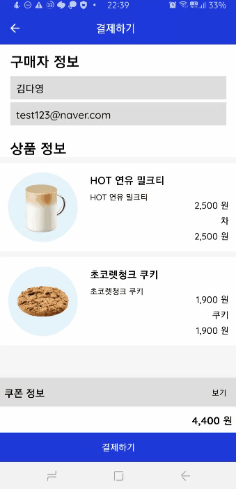|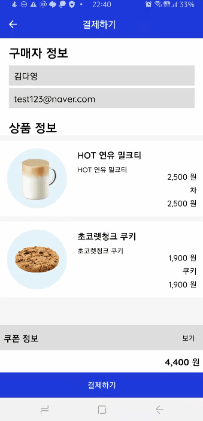|

| 카카오페이 결제 | 결제완료 |
|:----:|:----:|
|||
 

<h5>기타</h5>

- 쿠폰/스탬프 개수 올라가는 애니메이션 구현
  - CoroutineScope, Dispatcher.IO, suspend
- 로그아웃 기능 구현
  - SharedPreference에 있는 사용자 정보 삭제

| 사용자 정보 | 스탬프 |
|:----:|:----:|
|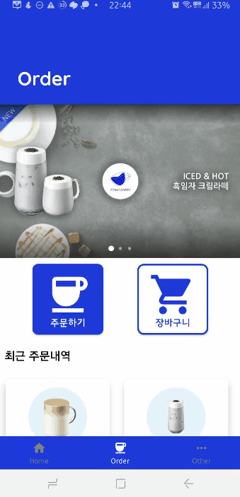|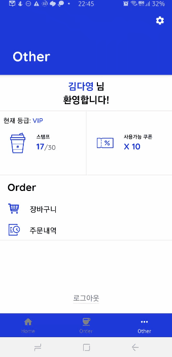|

| 쿠폰 | 주문내역 |
|:----:|:----:|
|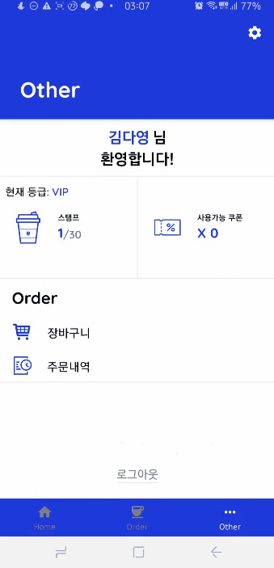||
 

<h5>설정</h5>

- Retrofit 이용하여 사용자 테이블 정보수정
- 토글 가능한 버튼 UI 구현 (SwitchButton)

| 설정 | 닉네임 변경 | 비밀번호 변경 |
|:----:|:----:|:----:|
|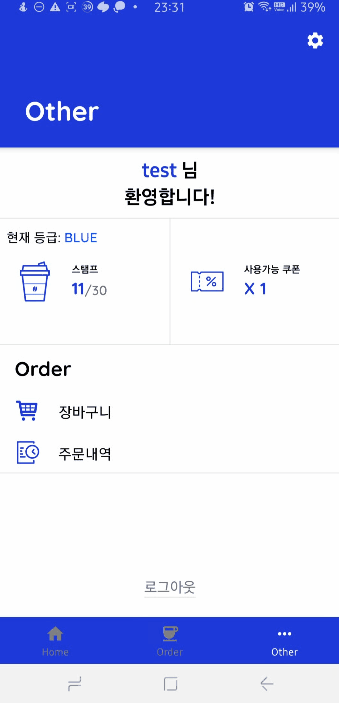|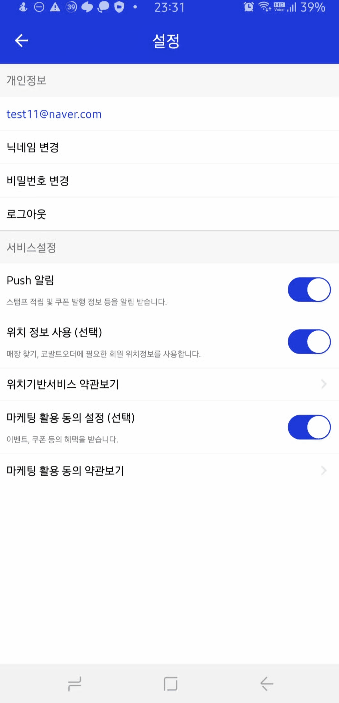||

| 푸쉬 알림 | 위치 권한 | 마케팅 활용 정보동의 |
|:----:|:----:|:----:|
||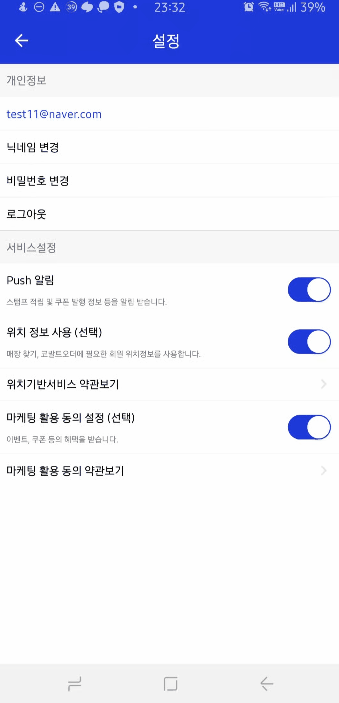|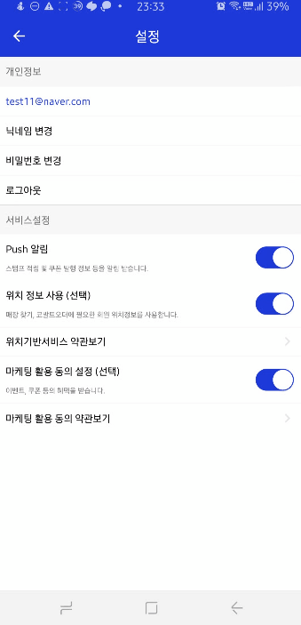|
 
